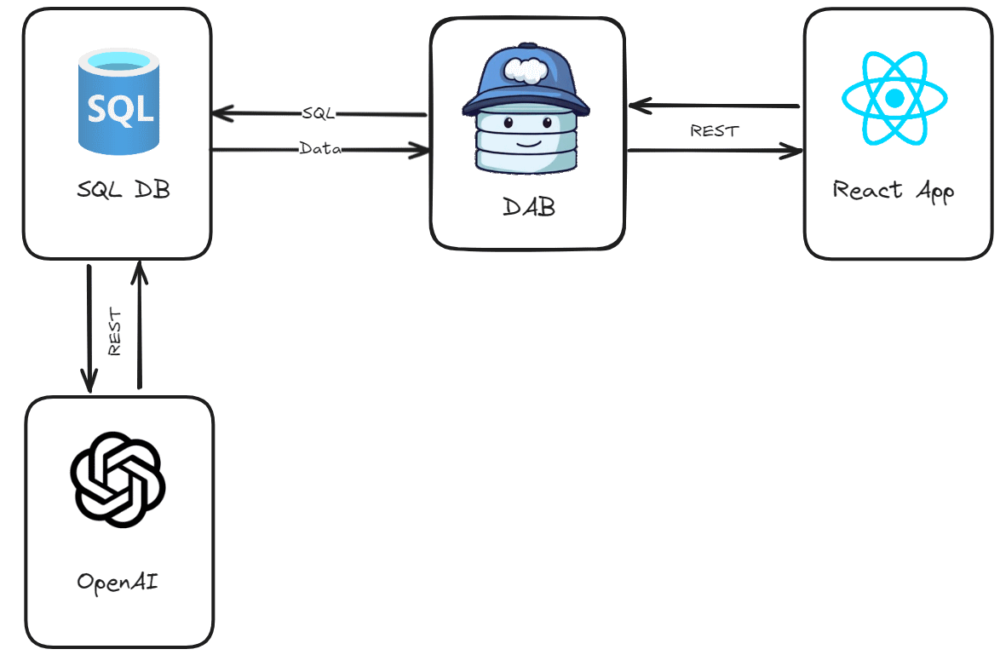

# Azure SQL Samples Search with AI

This sample demonstrates how to use Azure SQL to store and search data with AI. The sample uses RAG pattern, implementend with Azure SQL, to search for the most relevant code and end-to-end samples based on the user query. The results are then generated by AI to provide the most relevant documents to the user, with also a description of why the results are relevant.

The live websites is available here: https://ai.awesome.azuresql.dev/

## Architecture

The architecture of the sample is as follows:

[](./_assets_/ai-samples-search-azure-sql.png)

1. **Azure SQL database** stores the samples data and the related embeddings. 
    - The **embeddings** are generated when a sample is added or updated to the database, using and embedding model hosted in Azure OpenAI. 
    - The **RAG pattern** is fully implemented in the database, using GPT-4o model to generate the results with a well-defined **structured** format, so tht results can be easily joined back with the samples data.

2. **Data API builder** is used to exposed stored procedure for searching and adding samples to the database. The API is used by the web application to interact with the database.

3. **React** front-end application is used to search for samples and display the results. 

## Azure Services

The whole architecture is built using the following Azure services:

- [Azure SQL Database](https://learn.microsoft.com/en-us/azure/azure-sql/database/sql-database-paas-overview?view=azuresql): to store and query the samples data and embeddings.
- [Azure Static Web Apps](https://learn.microsoft.com/en-us/azure/static-web-apps/overview): to host the full-stack application, including the front-end and the [backend API for Azure SQL](https://learn.microsoft.com/en-us/azure/static-web-apps/database-overview).
- [Azure OpenAI](https://learn.microsoft.com/azure/ai-services/openai/): to generate the embeddings for the samples data and to generate the results using the RAG pattern.

## Solution

### Pre-requisites

Local development is possible, but you still have to have an Azure OpenAI subscription to generate the embeddings and the results.
All you need to have to run the sample locally is 

- [Node](https://nodejs.org/en) - to run the front-end application.
- [DotNet SDK 8](https://dotnet.microsoft.com/en-us/download/dotnet/8.0) or later to run Data API builder and deploy the database.
- [Static Web Apps CLI](https://learn.microsoft.com/en-us/azure/static-web-apps/static-web-apps-cli-overview) - to run the full-stack application locally.

### Azure Open AI

Make sure to have two models deployed, one for generating embeddings (*text-embedding-3-small* model recommended) and one for handling the chat. The model **must** support structured output: *gpt-4o* version *2024-08-06* is recommended. You can use the Azure OpenAI service to deploy the models. Make sure to have the endpoint and the API key ready. The two models are assumed to be deployed with the following names:

- Embedding model: `text-embedding-3-small`
- Chat model: `gpt-4o`, version `2024-08-06`

### Configure environment 

Create a `.env` file starting from the `.env.sample` file:

- `OPENAI_URL`: specify the URL of your Azure OpenAI endpoint, eg: 'https://my-open-ai.openai.azure.com/'
- `OPENAI_KEY`: specify the API key of your Azure OpenAI endpoint
- `OPENAI_EMBEDDING_DEPLOYMENT_NAME`: specify the deployment name of your Azure OpenAI embedding endpoint, eg: 'text-embedding-3-small'
- `OPENAI_CHAT_DEPLOYMENT_NAME`: specify the deployment name of your Azure OpenAI chat endpoint, eg: 'gpt-4o'
- `MSSQL`: the connection string to the Azure SQL database where you want to deploy the database objects and sample data

### Database

Since the database is using the new `vector` data type, you need use Azure SQL (you can use the [Free offer](https://learn.microsoft.com/en-us/azure/azure-sql/database/free-offer?view=azuresql)) or just announced [SQL database in Microsoft Fabric (Public Preview)](https://aka.ms/announcingsqlfabric) or the [SQL Server 2025 (EAP)](https://aka.ms/sqleapsignup).

> [!NOTE]  
> Vector Functions are in Public Preview. Learn the details about vectors in Azure SQL here: https://aka.ms/azure-sql-vector-public-preview

To deploy the database, make sure you have created the `.env` file as explained in the previoud section, and then run the following command:

```bash 
dotnet run --project ./db
```

That will connect to Azure SQL and deploy the needed database objects and some sample data.

### Application

Once the database has been deployed, you can run the full-stack application locally. Install the Node dependencies, by running the following commands from the root folder:

```bash
cd client && npm install && cd ..
```

Then, you can run the application locally using the Static Web Apps CLI. Make sure you have the `.env` file created as explained in the previous section, and then run the following command:

```bash
swa start
```

Once the application is running, you can access it at `http://localhost:4280`.

Data API builder may take a few seconds to run if you are using Azure SQL and EntraID authentication. You can check if Data API builde is running by accessing `http://localhost:4280/data-api/rest/countSamples`.

### Azure deployment

The easiest way to deploy the full-stack application is to fork the repository and then create a new Static Web Apps pointing to the forked repository. Once the Static Web App is deployed, configured the [Database Connection](https://learn.microsoft.com/en-us/azure/static-web-apps/database-overview) feature of Static Web Apps to connect to the Azure SQL database where you have deployed the database objects and the sample data.

Make sure you give the user thay you are using to connect to the database the permission to run the needed stored procedures:

```sql
GRANT EXECUTE ON SCHEMA::[web] TO [<your user>]
GRANT EXECUTE ANY EXTERNAL ENDPOINT TO [<your user>];
GRANT REFERENCES ON DATABASE SCOPED CREDENTIAL::[<openai_url>] TO [sql-aisearch];
```

replace `<your user>` with the user you are using to connect to the database and `<openai_url>` with the name of the database scoped credential you are using to connect to Azure OpenAI, which is the same as the value you used for the `OPENAI_URL` variable in the `.env` file.

That's it! You can now access the full-stack application deployed in Azure Static Web Apps.

## Sample Data

You can add some data do play with using the `sample-data.sql` file in the `db/sample` folder.